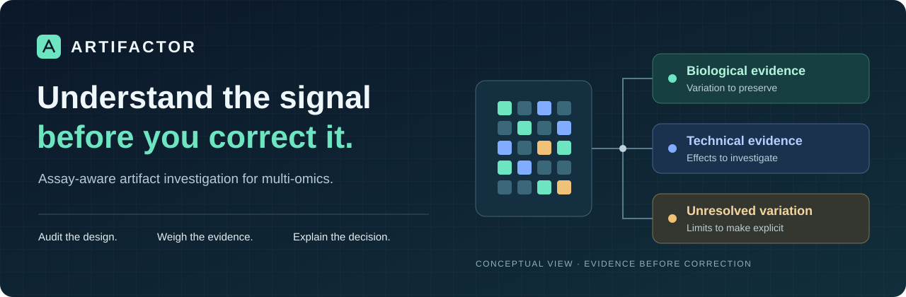
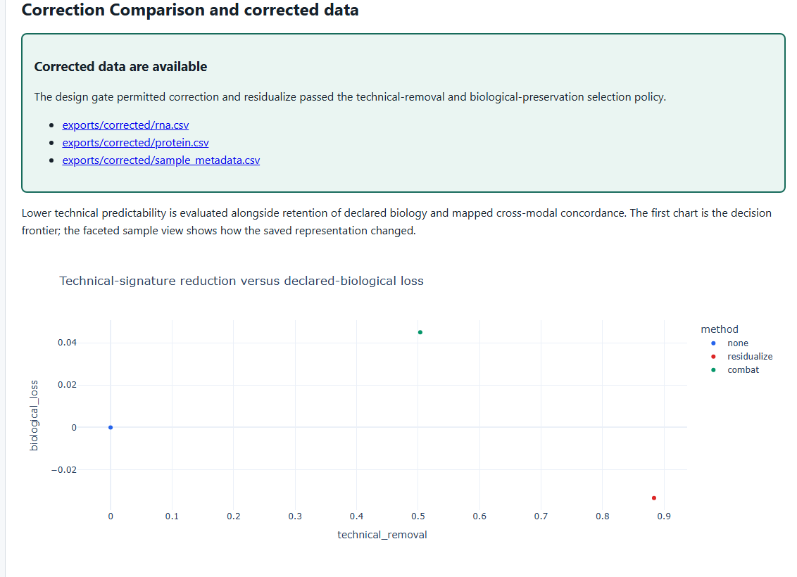

<p align="center">
  
</p>

# Artifactor

**Understand what drives your multi-omic signal—and whether correction is justified.**

Artifactor investigates technical artifacts in analysis-ready omics data. It audits the study design, connects major sources of variation to sample metadata, and compares corrections against biological-preservation criteria. Each run produces an offline, interactive evidence report and a traceable record of its decision.

**The central design principle: correction must be earned by the evidence.** When biology and batch cannot be separated, Artifactor explains the limitation and recommends follow-up experiments.

**Python 3.12+ · CLI + Streamlit · Nextflow · Proprietary · Research prototype**

**Source available for inspection only.** You may review the code to assess the authors' work. Running, modifying, or redistributing it requires separate written permission, subject to the platform and legal exceptions in the [license](LICENSE).

[See the output](#see-the-output) · [Engineering](#engineering-decisions) · [Authorized setup](#quick-start) · [Documentation](#documentation) · [License](#license-and-citation)

## Why this exists

A treatment effect and a processing-batch effect can produce similar patterns in an omics dataset. Removing batch-associated variation without checking the experimental design can also remove the biology the study was meant to measure.

Artifactor makes that ambiguity part of the analysis. It helps computational biologists and assay-development teams answer three questions:

1. **What is driving the variation?** Identify factors consistent with declared biology, technical effects, mixed signals, or insufficient evidence.
2. **Can the study distinguish those effects?** Check design rank, sample overlap, and confounding before permitting correction.
3. **Would correction improve the data?** Evaluate technical-signal reduction alongside biological retention and cross-modal concordance.

## From measurements to a defensible decision


| Capability | What it provides |
| --- | --- |
| Guided study setup | Single- or multi-matrix import, sample-orientation inspection, metadata-role review, and preflight checks. |
| Design-aware diagnostics | Modality PCA, balanced block PCA, metadata associations, permutation testing, and bootstrap stability. |
| Correction evaluation | An uncorrected baseline, protected-covariate residualization, and a location/scale batch harmonizer, compared under preservation criteria. |
| Targeted-NGS investigation | Count-aware coverage models, depth-aware allele diagnostics, callability checks, and run/lot or FFPE-like evidence. |
| Reviewable deliverables | Interactive HTML reports, evidence cards, follow-up recommendations, export manifests, and machine-readable artifacts. |

The `combat` option implements a location/scale baseline inspired by ComBat; it does **not** implement empirical-Bayes shrinkage. See the [methods](docs/methods.md) for the precise statistical scope.

## See the output



*An actual offline HTML report from the `separable` demonstration, generated with v0.5.0 and seed `20260805`. The cohort is synthetic; this is an application screenshot, not a mockup. [Visual provenance](docs/assets/README.md).*

The paired demonstrations make the decision policy concrete:

| Synthetic study | Study design | Result |
| --- | --- | --- |
| `separable` | Biology and processing batch have independent support. | Selects `residualize` and exports corrected RNA and protein matrices after the preservation checks pass. |
| `confounded` | Biology and batch cannot be independently identified. | Completes the analysis, refuses correction, and records why no corrected dataset was generated. |

A refusal is a useful result: it directs attention to bridge samples, balanced replication, or randomized reprocessing that could resolve the uncertainty.

## Quick start

**For maintainers and separately authorized users.** The installation, execution, and development instructions throughout this repository document the workflow; they do not grant permission to run or modify the software. Obtain written authorization covering those activities before proceeding. See [LICENSE](LICENSE).

Install from source with **Python 3.12+** and **uv** available:

```bash
git clone https://github.com/TimRoane/Artifactor.git
cd Artifactor
uv sync --all-extras --locked
uv run artifactor start
```

The start screen offers **Analyze my data**, **Try a demonstration**, and **Open a completed run**. The guided path handles project configuration, sample matching, and review of biological, technical, and protected variables.

### Reproduce the demonstrations from the CLI

No external dataset is needed. These commands generate and analyze both synthetic studies:

```bash
uv run artifactor simulate --scenario separable --output demo/separable
uv run artifactor analyze --config demo/separable/config.yaml

uv run artifactor simulate --scenario confounded --output demo/confounded
uv run artifactor analyze --config demo/confounded/config.yaml
```

Each `analyze` command prints its completed run directory. Open `report/artifactor-report.html` inside that directory in a browser; the report and its interactive plots work offline. Keep the run directory together to use its linked artifact downloads.

Replace `<run-directory>` below with the printed path:

```bash
uv run artifactor outputs --run <run-directory>
uv run artifactor inspect --run <run-directory> --section factors
uv run artifactor serve --run <run-directory>
```

Other deterministic scenarios include `cross_modal`, `plate_drift`, and `ngs_separable`. The [demo guide](docs/demo_script.md) explains what to inspect.

### Analyze your own study

Start with a sample-metadata table and one or more numeric measurement matrices in CSV, TSV, or Parquet format. Use normalized or otherwise analysis-ready continuous measurements. Metadata identifies biological variables to preserve and technical variables to investigate.

```bash
uv run artifactor init --input expression.csv --metadata metadata.csv --project projects/my-study --biological condition --technical batch --protected condition
uv run artifactor preflight --config projects/my-study/config.yaml
uv run artifactor analyze --config projects/my-study/config.yaml
```

Here, `condition` and `batch` must be columns in your metadata. Repeat `--input` to add modalities. Project initialization writes normalized copies and configuration into the project directory while preserving source files. See [getting started](docs/getting_started.md) for table examples and metadata roles.

For targeted NGS, use the dedicated [coverage and allele-count data contract](docs/targeted_ngs.md). Run `uv run artifactor capabilities` to inspect supported modality operations.

## What a run delivers

| Artifact | Purpose |
| --- | --- |
| `report/artifactor-report.html` | Offline report with the design audit, factor exploration, correction comparison, evidence, and provenance. |
| `exports/corrected_data.json` | Continuous-run export decision: whether corrected data are available, the selected method, and the reason. |
| `exports/corrected/` | Selected corrected continuous matrices and aligned metadata, emitted only when the selection policy permits. |
| `design/`, `factors/`, `evaluation/` | Persisted continuous-analysis evidence and metrics for inspection or downstream tooling. |
| `run.json` | Run identity, configuration and input provenance, versions, timings, warnings, and checksums. |

Targeted-NGS runs use dedicated `ngs/` artifacts. Their coverage representations are explicitly exploratory; original coverage counts, allele counts, VAF observations, and call states remain unchanged.

## Engineering decisions

The implementation connects statistical analysis, a usable research workflow, and reproducible execution:

| Decision | Why it matters | Explore the code |
| --- | --- | --- |
| Typed configuration and data contracts | Reject incompatible inputs early and make scientific assumptions explicit at module boundaries. | [Configuration](artifactor/config.py), [contracts](artifactor/contracts/) |
| Identifiability as an execution gate | A confounded design can block correction before any candidate is selected. | [Design audit](artifactor/design/), [correction](artifactor/correction/) |
| Separate diagnostics, evaluation, and interpretation | Keeps numerical evidence, selection rules, and explanatory claims inspectable. | [Diagnostics](artifactor/diagnostics/), [evaluation](artifactor/evaluation/), [interpretation](artifactor/interpretation/) |
| Persisted artifacts as the reporting boundary | Reports can be rebuilt and completed runs explored without refitting scientific models. | [Reporting](artifactor/reporting/), [Streamlit app](app/) |
| One Python analysis implementation | The CLI, guided application, and Nextflow workflow use the same scientific pipeline. | [Pipeline](artifactor/pipeline.py), [CLI](artifactor/cli.py), [Nextflow](main.nf) |
| Fingerprinted runs and explicit provenance | Run identity derives from normalized configuration, input checksums, package version, and seed; comparisons separate scientific results from environment differences. | [Run comparison](artifactor/reproducibility.py) |

Execution profiles cover local, Docker, and Slurm/Apptainer setups. AWS Batch configuration is a placeholder requiring infrastructure and credentials; executor validation status is tracked separately from configuration availability. See [HPC and cloud execution](docs/hpc_cloud.md).

## Validation and scientific scope

The test suite includes unit and property tests, pipeline and UI integration tests, report-rebuild checks, and fixed-seed scientific regression scenarios. The regression checks exercise technical-signal reduction, biological retention, correction refusal, cross-modal behavior, and targeted-NGS safeguards.

Public-data validation workflows are included for **CPTAC ccRCC** and **SEQC2 Oncopanel**, with frozen source definitions, deterministic preparation, preregistered questions, and explicit `pass`, `partial`, `fail`, or `not_evaluable` outcomes. These workflows record evidence and limitations; their existence is not a claim of broad external validation. See [external validation](docs/external_validation.md) and [measured benchmarks](docs/benchmarks.md) for scope and measurement conditions.

**Artifactor is a research prototype.** Its findings describe statistical associations and testable hypotheses, not causal or clinical conclusions. Biological-preservation checks evaluate declared variables and measured criteria; they cannot guarantee that every biological signal is retained. Targeted-NGS inputs are analysis-ready summaries, not FASTQ, BAM, CRAM, VCF, or BCF files. Read processing, variant calling, and clinical interpretation are outside the project’s scope.

## Development

Development and testing require separate written permission covering those activities. See [contributing](CONTRIBUTING.md).

After `uv sync --all-extras --locked`, run the checks used by the quality CI job:

```bash
uv run ruff check .
uv run ruff format --check .
uv run mypy artifactor
uv run pytest -m "not slow"
```

Run `uv run pytest -m slow` for the scientific regression scenarios. See [contributing](CONTRIBUTING.md) for development conventions and the [changelog](CHANGELOG.md) for release history.

## Documentation

| If you want to… | Start here |
| --- | --- |
| Set up a study and understand the downloads | [Getting started](docs/getting_started.md) |
| Review the statistics and interpret the evidence | [Methods](docs/methods.md) · [Metric definitions](docs/metric_definitions.md) · [Interpretation guide](docs/interpretation_guide.md) |
| Investigate targeted-NGS artifacts | [Targeted-NGS guide](docs/targeted_ngs.md) |
| Understand or extend the implementation | [Architecture](docs/architecture.md) · [Data contract](docs/data_contract.md) · [Modality extension guide](docs/modality_extension_guide.md) |
| Review reproducibility and execution evidence | [External validation](docs/external_validation.md) · [Benchmarks](docs/benchmarks.md) · [HPC and cloud](docs/hpc_cloud.md) |

## License and citation

Copyright (c) 2026 Artifactor contributors. All rights reserved.

Artifactor is proprietary software published under the [Artifactor Source Inspection License](LICENSE). You may view and read the source to assess the authors' work, including for hiring and portfolio review. Installing, building, running, testing, modifying, redistributing, or incorporating the software into another project requires separate written permission, except where the license preserves platform rights, applicable legal exceptions, or previously granted permissions. Third-party materials retain their own terms.

GitHub's applicable terms still permit viewing and forking through the service. Public availability does not grant a general right to use Artifactor. Contact the maintainer through this repository for additional permissions.

For citation metadata, see [CITATION.cff](CITATION.cff). Citation or attribution does not substitute for permission.
