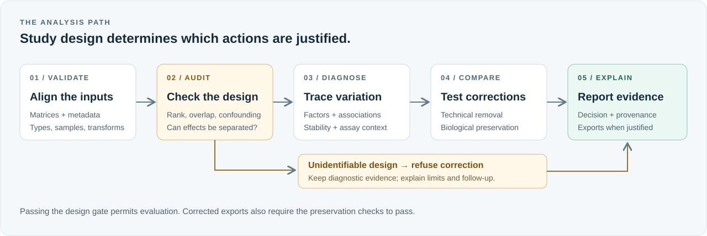

# Artifactor

**Artifactor helps determine whether an observed multi-omic signal is likely biological, technical, mixed, or not identifiable from the current study design.**

It audits identifiability before correction, compares uncorrected, covariate-residualized, and location/scale batch-harmonized representations, and selects a result on a biological-preservation versus technical-removal frontier. The output is a scientist-facing report with evidence, limitations, and a proposed confirmation experiment. Artifactor is a research prototype: associations are not causal or clinical conclusions.



## Example decision

In the balanced synthetic cohort, a condition-associated latent factor is retained while a processing-batch factor is reduced. In the confounded cohort, Artifactor refuses automated correction and recommends bridge samples or randomized reprocessing.

## Quick start

```bash
uv sync --all-extras
uv run artifactor simulate --scenario separable --output demo/separable
uv run artifactor analyze --config demo/separable/config.yaml
uv run artifactor inspect --run demo/separable/results/separable-demo-<fingerprint>
uv run artifactor serve --run demo/separable/results/separable-demo-<fingerprint>
```

Use `--scenario confounded`, `cross_modal`, or `plate_drift` for the other deterministic demonstrations. The `quick` budget uses 99 permutations and compact resampling; `standard` is intended for the complete analysis settings.

## What happens

1. Strict YAML and matrix validation aligns samples and rejects raw counts without an explicit transform.
2. A rank, overlap, and pairwise confounding audit gates all correction.
3. Robustly scaled modality PCA and Frobenius-balanced block PCA expose major variation.
4. Metadata association and partial technical variance quantify evidence.
5. Candidate corrections are scored for technical predictability, biological retention, and cross-modal concordance.
6. Persisted artifacts drive both a standalone HTML report and a read-only Streamlit UI.

The Python package contains all scientific logic. Nextflow only orchestrates the same CLI, and the UI never refits models.

## Reproducibility and scaling

Each run directory is named from normalized configuration, input checksums, package version, and seed. `run.json` records timestamps, versions, host details, stage timings, warnings, and checksums. The included Nextflow profiles cover local, Docker, Slurm/Apptainer, and documented AWS Batch placeholders without provisioning infrastructure.

## Limitations

The MVP accepts analysis-ready continuous matrices. Its `combat` option is a transparent Python-native location/scale harmonizer rather than an empirical-Bayes implementation. Repeated measures, raw-count models, causal inference, and clinical use are out of scope. Preservation can only be assessed against declared metadata and observed signals.

## Development

```bash
ruff check .
ruff format --check .
mypy artifactor
pytest -m "not slow"
```

See [methods](docs/methods.md), [data contract](docs/data_contract.md), [architecture](docs/architecture.md), and the [demo script](docs/demo_script.md).
Measured quick/standard results and their test dimensions are in [benchmarks](docs/benchmarks.md).
