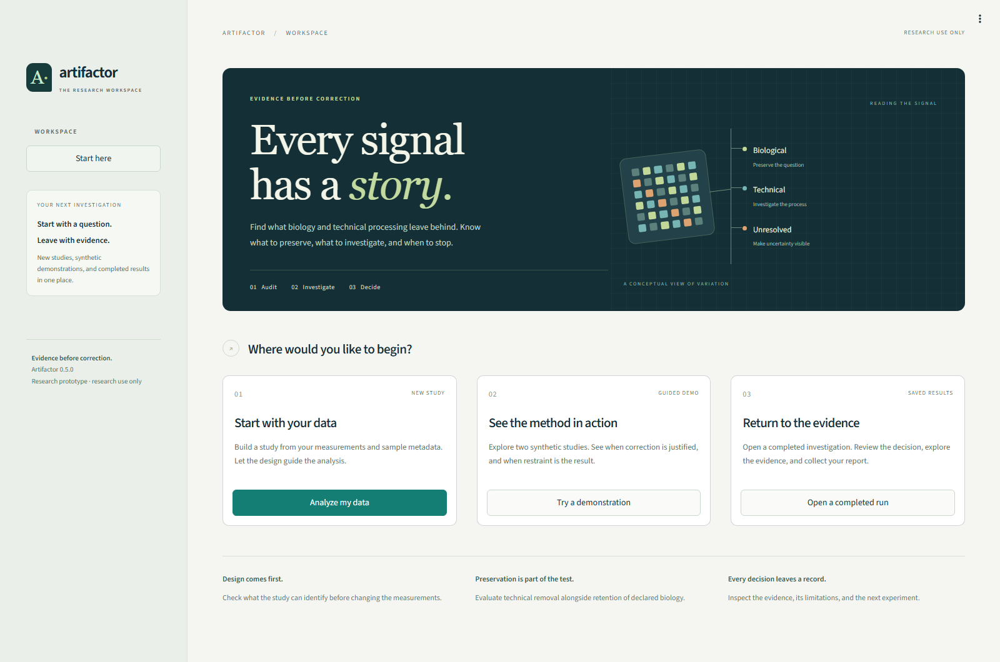
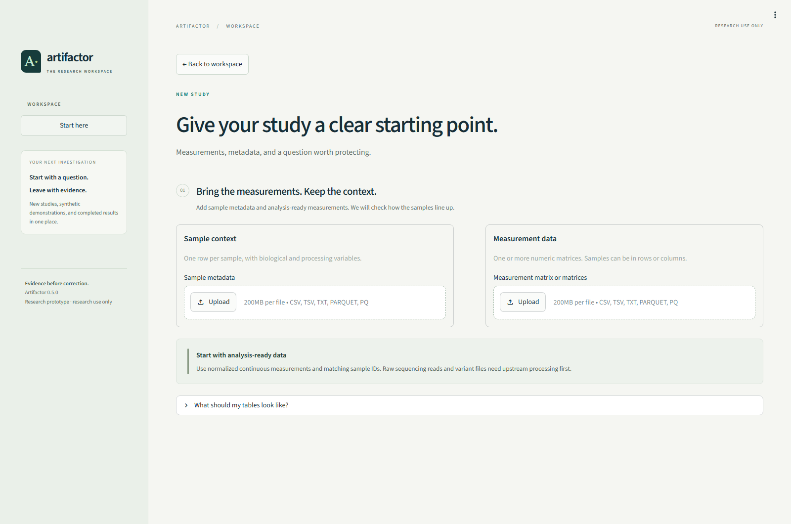
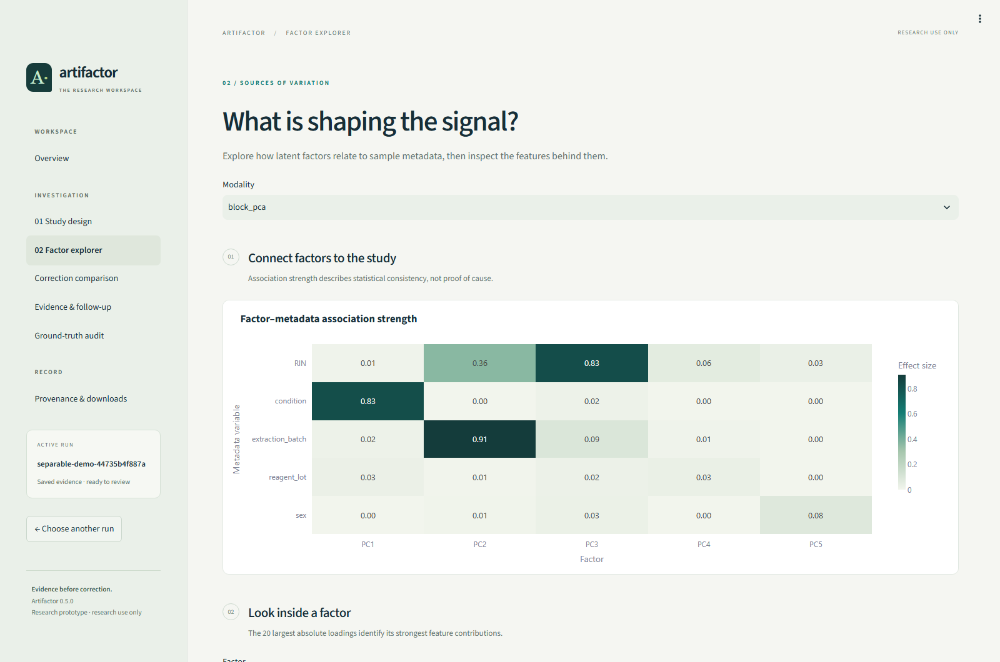
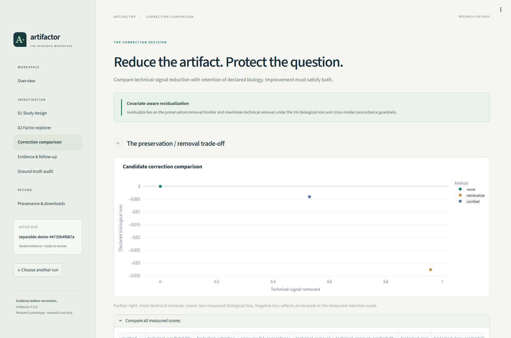
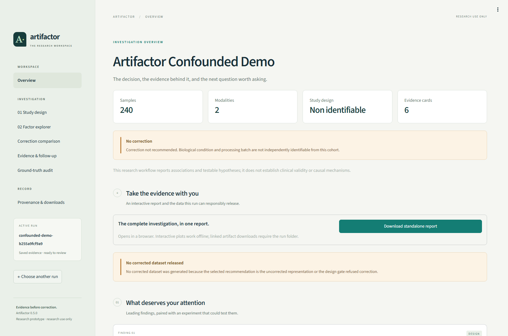
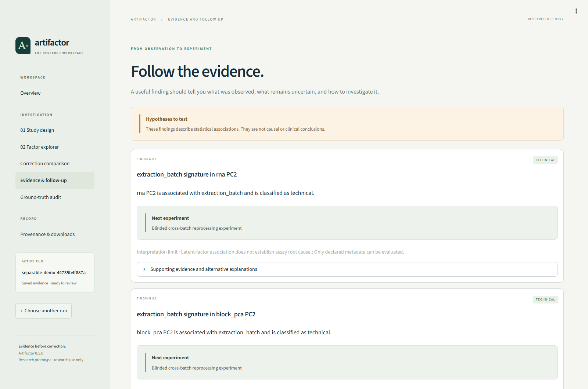
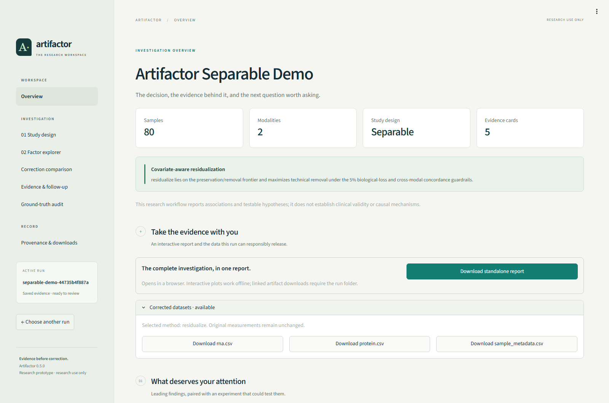

# Artifactor

**Every signal has a story. Understand it before you correct it.**

Artifactor is a scientific workspace for investigating technical artifacts in analysis-ready omics data. It connects study-design checks, statistical diagnostics, and correction evaluation in an interface built to make the reasoning visible—from the first uploaded matrix to the final evidence report.

**Python 3.12+ · Streamlit + Plotly · Typed scientific Python · Nextflow · Research prototype**

**Source available for inspection only.** Portfolio and hiring review are permitted under the [Artifactor Source Inspection License](LICENSE). Running, modifying, or redistributing the software requires separate written permission, subject to the exceptions in that license.

[Workspace tour](#workspace-tour) · [Engineering](#engineering-decisions) · [Authorized setup](#run-locally-with-permission) · [Documentation](#documentation)



*The actual Streamlit application. Start a study, explore a synthetic demonstration, or return to a saved investigation.*

## The question behind the product

A treatment effect and a processing-batch effect can produce similar patterns in an omics dataset. Removing batch-associated variation without checking the study design can also remove the biology the experiment was intended to measure.

Artifactor asks three questions in order: **Can the study separate those effects? What evidence supports the interpretation? Does correction preserve the declared biology?**

Correction must be earned by the evidence. When biology and batch cannot be independently identified, the analysis records an explained refusal and proposes follow-up experiments.

## Workspace tour

The interface follows the investigation: **set up → audit → explore → compare → explain**. Results pages read saved artifacts, so navigating a completed run does not refit the analysis.

All result screenshots below use synthetic cohorts from the included simulator. They demonstrate application behavior, not external or clinical validation. [Capture details and reproduction instructions](docs/assets/README.md).

### 1. Give the study a clear starting point

**Analyze my data** pairs measurement matrices with sample metadata. The guided workflow inspects sample orientation and matching, asks which variables represent biology or technical processing, and reviews the design before analysis. Protected variables make the preservation requirements explicit.

<details>
<summary><strong>View the study setup screen</strong></summary>



*CSV, TSV, and Parquet inputs; one or more continuous matrices. Sample matching and metadata-role review follow the uploads.*

</details>

### 2. Find what is shaping the signal

The **Factor explorer** connects latent factors to study metadata. A consistent heatmap makes the associations readable, while factor selection exposes the strongest feature loadings and supporting evidence.



*In this demonstration, condition aligns with PC1, extraction batch with PC2, and RIN with PC3. These associations are evidence to investigate, not proof of cause.*

### 3. Compare correction against preservation

**Correction comparison** puts technical-signal reduction and declared-biological loss on the same chart. The uncorrected baseline remains visible alongside candidate methods, and the eligibility trail explains what the study can support.



*The separable demonstration selects covariate-aware residualization. Further right indicates more technical removal; lower indicates less measured biological loss.*

The decision policy also has to handle studies that cannot support correction:

| Synthetic scenario | What the design supports | Result |
| --- | --- | --- |
| `separable` | Biology and batch have independent support. | Evaluates candidates, selects `residualize`, and releases corrected RNA and protein matrices. |
| `confounded` | Biology and batch cannot be independently identified. | Completes the investigation, refuses correction, and explains why no corrected dataset is released. |

<details>
<summary><strong>View the refusal case</strong></summary>



*A refusal is a useful result. It points toward bridge samples, balanced replication, or randomized reprocessing that could resolve the uncertainty.*

</details>

### 4. Leave with evidence and a next step

**Evidence & follow-up** presents each finding with its observation, interpretation limits, and a proposed experiment. Supporting evidence and alternative explanations remain available for closer review.

<details>
<summary><strong>View the evidence cards</strong></summary>



*The observation, its limitation, and a testable follow-up stay together.*

</details>

The **Overview** brings the decision and downloads together. Each run provides an interactive HTML report that works offline; eligible continuous-data runs also expose their selected corrected matrices and aligned metadata.

<details>
<summary><strong>View the completed-run overview and downloads</strong></summary>



*Keep the run directory together to use the report's linked artifact downloads. An export manifest records whether corrected data were generated and why.*

</details>

## What powers the investigation


| Layer | Implementation |
| --- | --- |
| Input and design checks | Typed configuration, sample alignment, explicit transforms, design rank, overlap, and pairwise confounding audits. |
| Continuous-data diagnostics | Robust scaling, modality PCA, balanced block PCA, metadata associations, permutation testing, and bootstrap stability. |
| Correction evaluation | An uncorrected baseline, protected-covariate residualization, and a location/scale harmonizer evaluated against preservation criteria. |
| Targeted-NGS investigation | Count-aware coverage models, depth-aware allele diagnostics, callability checks, and run/lot or FFPE-like evidence. |
| Evidence and delivery | Interpretation cards, follow-up recommendations, offline HTML reports, export manifests, and recorded provenance. |

The `combat` option is a location/scale baseline inspired by ComBat; it does **not** implement empirical-Bayes shrinkage. Targeted-NGS coverage representations are exploratory, and original counts, allele observations, VAFs, and call states remain unchanged. See the [methods](docs/methods.md) and [targeted-NGS guide](docs/targeted_ngs.md).

## Engineering decisions

| Decision | Why it matters | Code |
| --- | --- | --- |
| Shared presentation system | Typography, navigation, decision notices, evidence cards, and Plotly styling stay consistent across the workspace. | [Presentation components](app/design.py) · [Stylesheet](app/assets/workspace.css) · [Navigation and downloads](app/common.py) |
| Typed scientific boundaries | Reject incompatible inputs early and make assumptions explicit between modules. | [Configuration](artifactor/config.py) · [Contracts](artifactor/contracts/) |
| Identifiability before correction | Prevent unsupported correction when the design cannot separate protected biology from technical effects. | [Design audit](artifactor/design/) · [Correction methods](artifactor/correction/) |
| Separate analysis and presentation | Completed-run pages and rebuilt reports consume saved evidence without refitting models. | [Pipeline](artifactor/pipeline.py) · [Reporting](artifactor/reporting/) · [UI integration checks](tests/integration/test_streamlit.py) |
| One scientific implementation | The guided application, CLI, and Nextflow workflow share the same Python pipeline. | [Application](app/Home.py) · [CLI](artifactor/cli.py) · [Nextflow](main.nf) |
| Reproducible run records | Configuration, input checksums, package version, and seed define run identity; comparisons distinguish scientific results from environment differences. | [Run comparison](artifactor/reproducibility.py) |

Execution profiles include local, Docker, and Slurm/Apptainer setups. AWS Batch configuration requires infrastructure and credentials; configuration availability is tracked separately from completed executor validation. See [HPC and cloud execution](docs/hpc_cloud.md).

## Run locally with permission

**For maintainers and separately authorized users.** These instructions document the workflow and do not grant execution or modification rights. Obtain the necessary written authorization under [LICENSE](LICENSE) before proceeding.

With **Python 3.12+** and **uv** available:

```bash
git clone https://github.com/TimRoane/Artifactor.git
cd Artifactor
uv sync --all-extras --locked
uv run artifactor start
```

Open **http://localhost:8501** if the browser does not open automatically. Choose **Try a demonstration** for the guided synthetic examples, **Analyze my data** for a new study, or **Open a completed run** to revisit saved evidence.

For an existing Windows checkout with its environment installed:

```powershell
.\.venv\Scripts\artifactor.exe start
```

<details>
<summary><strong>Command-line workflow</strong></summary>

Generate and analyze a deterministic synthetic study:

```bash
uv run artifactor simulate --scenario separable --output demo/separable
uv run artifactor analyze --config demo/separable/config.yaml
```

Repeat with `--scenario confounded --output demo/confounded` and its generated configuration to investigate the refusal case. Other scenarios include `cross_modal`, `plate_drift`, and `ngs_separable`. The guided UI uses smaller demonstration cohorts than the CLI defaults; see [screenshot provenance](docs/assets/README.md) for the displayed examples.

For a new continuous-matrix study:

```bash
uv run artifactor init --input expression.csv --metadata metadata.csv --project projects/my-study --biological condition --technical batch --protected condition
uv run artifactor preflight --config projects/my-study/config.yaml
uv run artifactor analyze --config projects/my-study/config.yaml
```

Here, `condition` and `batch` are metadata columns. Repeat `--input` to add modalities. The analysis prints its completed run directory; substitute that path below:

```bash
uv run artifactor outputs --run <run-directory>
uv run artifactor serve --run <run-directory>
```

See [getting started](docs/getting_started.md) for input examples and [the demo guide](docs/demo_script.md) for interpretation.

</details>

## Validation and scope

The test suite covers input contracts, statistical diagnostics, onboarding, report rebuilding, and navigation across continuous, confounded, and targeted-NGS results. UI integration checks verify that browsing completed runs does not modify their artifacts. Separate scientific regression scenarios exercise technical removal, biological retention, correction refusal, and cross-modal behavior.

Public-data workflows for **CPTAC ccRCC** and **SEQC2 Oncopanel** include frozen sources, deterministic preparation, preregistered questions, and explicit evaluation outcomes. Their availability is not a claim of broad external validation. Review the [external-validation scope](docs/external_validation.md) and [benchmark conditions](docs/benchmarks.md).

**Research prototype.** Findings are statistical associations and testable hypotheses, not causal or clinical conclusions. Preservation checks assess declared variables and measured criteria; they cannot guarantee retention of every biological signal. Raw read processing, variant calling, and clinical interpretation are outside scope.

For authorized development:

```bash
uv run ruff check .
uv run ruff format --check .
uv run mypy artifactor
uv run pytest -m "not slow"
```

Run `uv run pytest -m slow` for scientific regression scenarios. See [contributing](CONTRIBUTING.md) and the [changelog](CHANGELOG.md).

## Documentation

| Explore | References |
| --- | --- |
| Study setup and deliverables | [Getting started](docs/getting_started.md) · [Data contract](docs/data_contract.md) |
| Statistics and interpretation | [Methods](docs/methods.md) · [Metric definitions](docs/metric_definitions.md) · [Interpretation guide](docs/interpretation_guide.md) |
| Targeted-NGS analysis | [Coverage and allele-count guide](docs/targeted_ngs.md) |
| Architecture and extensions | [Architecture](docs/architecture.md) · [Modality extension guide](docs/modality_extension_guide.md) |
| Evidence and reproducibility | [External validation](docs/external_validation.md) · [Benchmarks](docs/benchmarks.md) · [HPC and cloud](docs/hpc_cloud.md) |

## License and citation

Copyright (c) 2026 Artifactor contributors. All rights reserved.

Artifactor is proprietary software published under the [Artifactor Source Inspection License](LICENSE). You may view and read the source to assess the authors' work, including for hiring and portfolio review. Installing, building, running, testing, modifying, redistributing, or incorporating the software into another project requires separate written permission, except where the license preserves platform rights, applicable legal exceptions, or previously granted permissions. Third-party materials retain their own terms.

GitHub's applicable terms still permit viewing and forking through the service. Public availability does not grant a general right to use Artifactor. Contact the maintainer through this repository for additional permissions.

For citation metadata, see [CITATION.cff](CITATION.cff). Citation or attribution does not substitute for permission.
